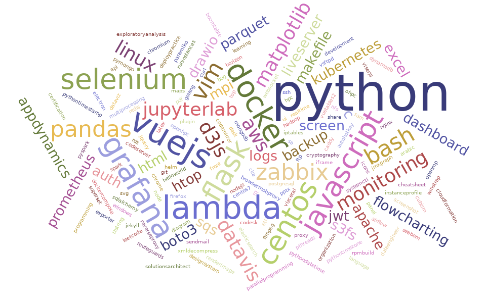

Welcome to my Profile!

### Carlos Aguni
~ Highly motivated self-taught IT analyst. Always learning and ready to explore new skills. An eternal apprentice. ~

| Github Pages | Linkedin | Medium |
| :----------: | :------: | :----: |
|  |  |  |

*  Education
    * Jan 2017 - Present Master's degreee, Computer Engineering
    * Jan 2012 - Dec 2016 ~ Bachelor's degree, Computer Information Systems
*  Languages
    *  Portuguese Native
    *  English Advanced
    *  Chinese Intermediate
    *  Arabic Basic 
*  Fun Facts
    * Based in Sao Paulo - Brazil since 2012
    * Favorite desset: papaya cream with cassis 
    * Learning Languages
    * Love dancing ~ all sorts
    * Skateboard
    * Born in Campo Grande - MS - Brazil.

### Welcome you to read some topics in my [blog](https://crashlaker.github.io)

[Wordcloud credits](https://www.jasondavies.com/wordcloud/)

[ca-logo]: ca-logo.png
